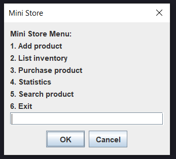

# 🛒 Mini Store OOP

> 📄 Este README también está disponible en [English 🇬🇧](README.md)

Un simple **sistema de gestión de inventario** construido con **Java, Programación Orientada a Objetos (POO) y estructuras de datos básicas**.  
Permite agregar, listar, comprar, buscar y generar estadísticas de productos utilizando una interfaz de menú basada en Swing (`JOptionPane`).

---

## ✨ Características

- ➕ Agregar nuevos productos (Alimento / Electrodoméstico) al inventario
- 📋 Listar todos los productos con precio, stock y descripción
- 🛒 Comprar productos con validación de stock y cálculo de subtotal
- 📊 Mostrar estadísticas: producto más caro y más barato
- 🔎 Buscar productos por coincidencias parciales de nombre
- 🧾 Generar un recibo final con el total de compras
- ⚠️ Validaciones de entrada para números, valores vacíos y duplicados

---

## 🖼️ Vista previa

Aquí tienes una vista previa del menú principal de la aplicación:



---

## 📂 Estructura del Proyecto

```bash
mini-store-oop/
├── src/
│   ├── main/
│   │   ├── java/
│   │   │   └── org.carturo.ministore/
│   │   │       ├── Main.java
│   │   │       ├── model/
│   │   │       │   ├── Product.java
│   │   │       │   ├── Food.java
│   │   │       │   └── Appliance.java
│   │   │       ├── service/
│   │   │       │   └── InventoryService.java
│   │   │       └── util/
│   │   │           └── Validation.java
├── .gitignore
├── LICENSE
├── pom.xml
├── README.md
└── README.es.md
```

---

## ⚙️ Requisitos

- JDK 21+ (probado con JDK 24)
- Maven 3
- IntelliJ IDEA u otro IDE para Java
- No se requieren librerías adicionales

---

## ▶️ Ejecutar la aplicación

1. Compila el proyecto en tu IDE.
2. Ejecuta `Main.java`.
3. Interactúa con el menú basado en Swing para gestionar el inventario.

---

## 📜 Licencia

Este proyecto está bajo la [Licencia MIT](LICENSE).